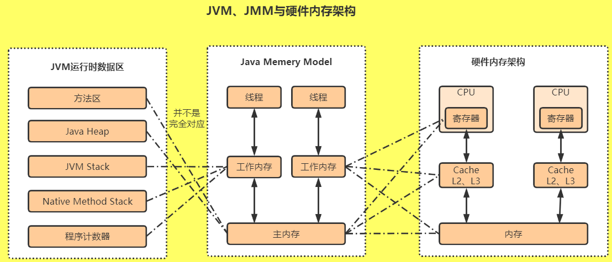

# java内存模型（Java Memery Model）

1. `主内存`（线程间共享）：存放共享信息
2. `工作内存`（线程间独立）：
   1. 私有信息，基本数据类型，直接分配到工作内存
   2. 引用的地址存放在工作内存，引用的对象存放在堆中

## JMM工作方式
1. 线程修改私有数据，直接在工作内存修改
2. 线程修改共享数据（主内存中的数据），将数据复制到工作内存中，在工作内存修改，修改完成后，刷新主内存数据

## JMM重要的规则和属性
1. `原子性`：不可分割的操作（long或double的读写操作不具有原子性，因数据大小为64位，在32位机器上不具有原子性）
   1. 保障方式：synchronized，java.util.concurrent包（JUC）中的Lock
2. `可见性`：一个线程对共享数据所做的更改对其他线程可见
   1. 保障方式：volatile实现的MESI，synchronized，java.util.concurrent包（JUC）中的Lock
3. `有序性`：执行程序时，为了提高性能，编译器和处理器常常会对指令做重排序
   1. 编译器优化的重排序。编译器在不改变单线程程序语义的前提下，可以重新安排语句的执行顺序。
   2. 指令级并行的重排序。现代处理器采用了指令级并行技术（Instruction-LevelParallelism，ILP）来将多条指令重叠执行。
      如果不存在数据依赖性，处理器可以改变语句对应机器指令的执行顺序。
   3. 内存系统的重排序。由于处理器使用缓存和读/写缓冲区，这使得加载和存储操作看上去可能是在乱序执行。
   4. 保障方式：volatile的内存屏障，synchronized，final?
4. `as-if-serial`：不管怎么重排序（编译器和处理器为了提高并行度），（单线程）程序的执行结果不能被改变
5. `happens-before`：如果一个操作执行的结果需要对另一个操作可见，那么这两个操作之间必须要存在happens-before关系

## 缓存一致性问题
因JMM的工作方式，多个线程并发写入同一个共享数据时，会出现工作内存与主内存数据不一致的情况

解决方案：
1. 总线（数据总线）加锁。但会降低CPU的吞吐量
2. 缓存一致性协议（MESI）
   1. 当CPU在Cache中进行共享数据修改时，数据从内存读到Cache，再从Cache读到寄存器中，进行修改，并更新内存数据
   2. 更新主内存诗句的同时，将所有Cache中对应的Cache line置无效，其他的CPU就从内存中读数据   

